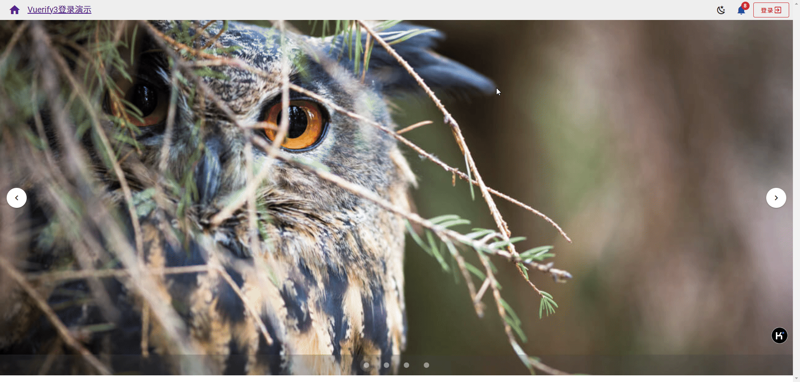
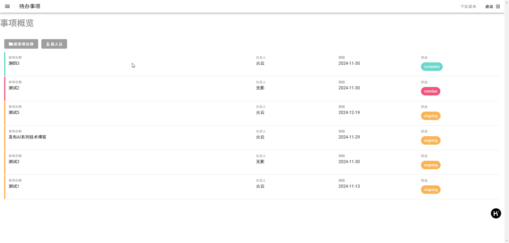

# Veutify3 + Vue3 Getting Started Tutorial

## Description
Examples of programming using the vuetify3 framework based on vue3.   
Each folder contains one instance.

### Simple photo album

This is a simple photo album that can be developed using `vuetify3`. The menu can be used to control the album to be displayed in color or gray.
In this example, we mainly use `Navigation drawers` for navigation and `Grids` to display album images.

 

Code can be found in the `gallery` folder.

### Classic Login

This is a login example that can be developed using `vuetify3`.
It contains a classic toolbar with system messages, a login button, a theme change button, a carousel, and a login form control.

 

Code can be found in the `login` folder.

### Todo management
This is a to-do management example that can be developed using `vuetify3`.  
It mainly includes the task overview, my project, and my team. The task overview lists all tasks in a list, where you can add tasks and sort them.

 

Code can be found in the `todo` folder.

## Installation

1. Install the dependent environment

It is recommended to use VS Code. After entering the `gallery` or `login` directory, execute the following command:
```cmd
npm install
pnpm dev
```

## Instructions

For tutorial, see：🔗[Veutify3 Programming Practice](http://www.wfcoding.com/articles/practice/02vuetify3%E7%BC%96%E7%A8%8B%E5%AE%9E%E6%88%98/)
