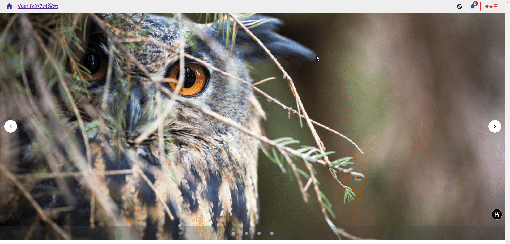
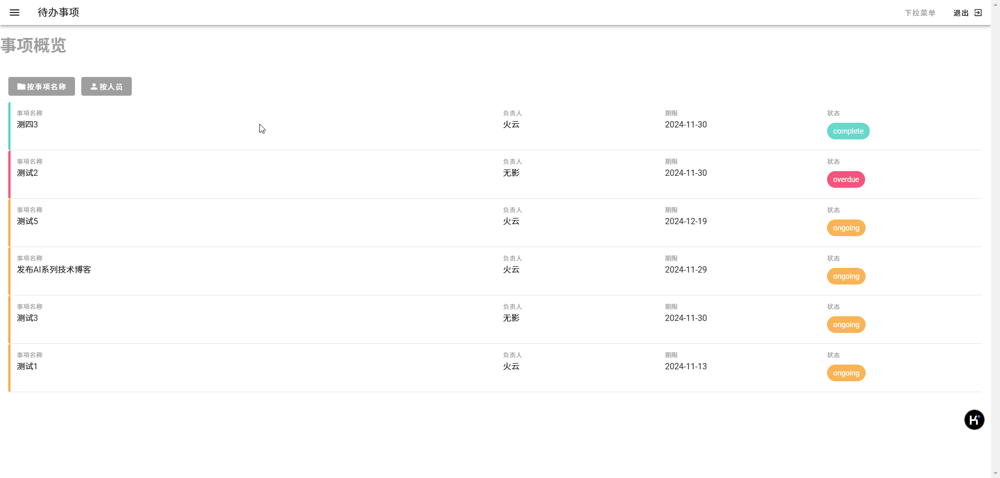

# veutify3 + vue3 入门实例

## 介绍
使用基于vue3的vuetify3框架的编程入门实例。  
每个文件夹包含一个实例。

### 简单的相册

这是使用`vuetify3`可以开发的一个简单的相册，通过菜单可以控制相册以彩色或者黑白方式显示。  
在这个例子中，我们主要使用 `抽屉式导航（Navigation drawers）` 做导航，使用`栅格（Grids）`显示相册图片。

 

代码见`gallery`文件夹。

### 经典的登录

这是使用`vuetify3`可以开发的一个登录实例。  
它包含了一个经典的包含系统消息、登录按钮、更换主题按钮的工具栏（toolbar）、轮播(carousel)和登录表单控件。 

 

代码见`login`文件夹。

### 待办事项管理
这是使用`vuetify3`可以开发的一个待办事项管理实例。  
它主要包含事项概览、我的项目、我的团队。其中事项概览中以列表的方式列出所有的事项，在这里可以添加事项、对事项进行排序。  

 

代码见`todo`文件夹。

## 安装教程

1. 安装依赖环境

使用VS Code，进入`gallery`或者`login`目录后，执行下面的命令：
```cmd
npm install
pnpm dev
```

## 使用说明

详细教程参见：🔗[veutify3编程实战](http://www.wfcoding.com/articles/practice/02vuetify3%E7%BC%96%E7%A8%8B%E5%AE%9E%E6%88%98/)
